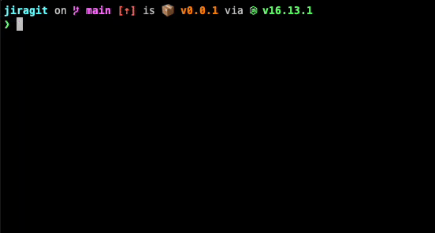
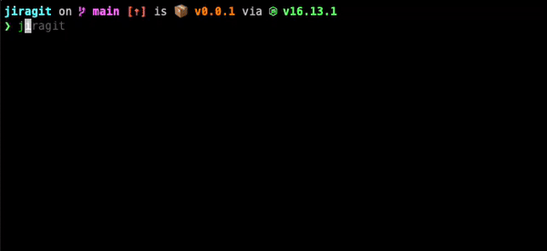

# @nirtamir2/jiragit


CLI to create git branches from JIRA tasks

## Demo

### Checkout task


### Create task


## Installation

```bash
npm i -g @nirtamir2/jiragit
```

## Running

```bash
jiragit
```

## Config

When you run the CLI in the first time, you need to edit the config file at `~/jiragit.config.json`.

```json
{
  "email": "me@mycompany.com",
  "token": "TODO: generate in https://id.atlassian.com/manage-profile/security/api-tokens",
  "host": "https://mycompany.atlassian.net",
  "projectKey": "Example: for issue like ABC-123 ABC is the project key"
}
```
